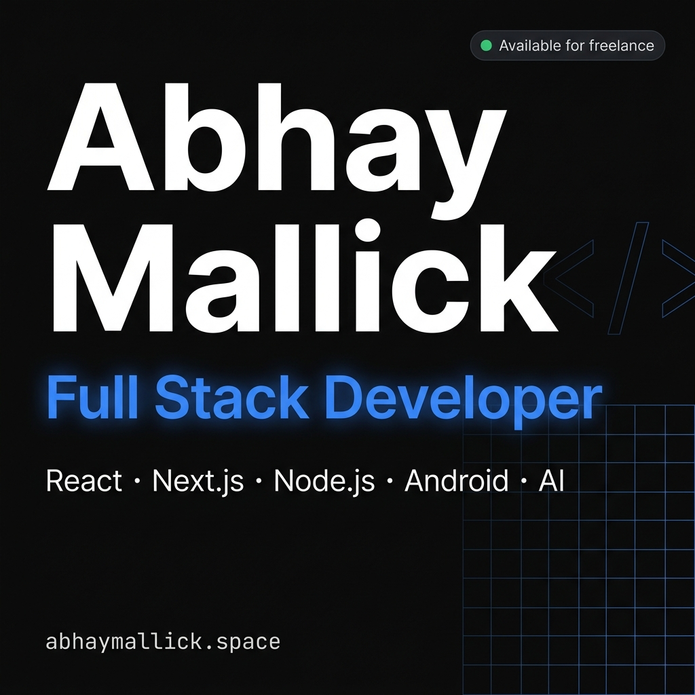

# <p align="center">🌌 abhaymallick.dev — The Portfolio Universe</p>

<p align="center">
  
  
  
  
  
</p>

<p align="center">
  <strong>An ultra-premium, interactive, and search-optimized digital masterpiece.</strong> Built for <strong>abhaymallick.space</strong> to deliver cinematic visual storytelling, flawless performance, and high-conversion client onboarding.
</p>

---

## 📸 Core Preview

<p align="center">
  
</p>

---

## ⚡ Engineering & Architecture Highlights

This is not a template. It is a highly optimized, high-fidelity experience engineered with precision:

*   **🎬 Scroll-Driven Canvas Video Renderer**: Implements high-performance sequential frame playback by mapping scroll coordinates directly to raw Canvas contexts with custom preloading algorithms. Combines `framer-motion` timelines with `requestAnimationFrame` to deliver liquid-smooth, GPU-accelerated video scrolls.
*   **🤖 Integrated AI Chatbot Interface**: Built-in interactive assistant framework designed to instantly engage recruiters, answer complex technical queries, and guide prospects to book meetings.
*   **📐 Swiss-Grid Editorial System**: Implements a strict, grid-based typography layout built with raw Tailwind CSS and standard custom transitions, inspired by high-end design agency architectures.
*   **📊 Dynamic Stacking Project Cards**: Implements viewport-aware physics equations that scale, overlay, and anchor project cards in sequence based on user scroll velocity.
*   **⚡ Hyper-Optimized Performance (Core Web Vitals)**: Aggressively optimized for speed. Includes strict image formatting (`.avif` and `.webp`), preconnected fonts, prefetch scripts, and caching structures inside `next.config.ts`.
*   **🧠 Structured Rich Schema Engine (JSON-LD)**: Boosts search indexability. Server-side custom script injection maps complex schema vectors to Google’s Knowledge Graph:
    *   `Person`: Connects social platforms, education, and bio info.
    *   `ProfessionalService`: Targets localized keywords (**Chandrapur, Maharashtra, India**) using exact GPS coordinates, service limits, currency settings, and operating hours.
    *   `FAQPage`: Generates search-accordion answers, allowing the portfolio to claim prime Google real estate.

---

## 🛠️ The Technical Arsenal

| Layer | Technologies Wielded with Precision |
| :--- | :--- |
| **Frontend Core** | React 19 • Next.js 16 (App Router) • TypeScript • HTML5 • CSS3 (Vanilla + Tailwind CSS v4) |
| **Motion & Audio** | Framer Motion (Scroll Sequences) • GSAP (Brutalist animations) • Web Audio API |
| **Backend & APIs** | Node.js • Express • Supabase • RESTful API Architecture • SQL & NoSQL Schema Design |
| **Databases & Cache** | PostgreSQL • MongoDB • Redis • IndexedDB |
| **Cloud & Systems** | AWS (S3, EC2) • Docker Containerization • Git Versioning • Vercel deployment |
| **Creative Suite** | Figma • Interactive Wireframing • Design Systems engineering |

---

## 📂 Feature Showcases & Selected Projects

### 🌌 AI & WebMaster Solutions
*   **Cosmic IDE**: A professional-grade, AI-native desktop IDE engineered with multi-language debugging, terminal integrations, and AI agent automation. `[Electron, React, Gemini API]`
*   **Nexus AI Task Commander**: Dynamic task-breaking scheduler implementing strict focus protocols and deep productivity intelligence engines. `[Next.js, Gemini API, Supabase]`
*   **InsightFlow**: Transform raw metrics into predictive strategies via intelligence-driven analytical dashboards. `[React, Recharts, Gemini API]`

### 🏢 Enterprise Architectures
*   **TAFE CRM**: Scalable educational pipeline system to handle registration, staffing, and cohort schedules. `[React, Node.js, PostgreSQL]`
*   **NE CRM**: Enterprise-level CRM equipped with predictive analytics triggers, business flows, and client nodes. `[React, Express, Supabase]`
*   **SmartCity Portal**: Next-generation citizen governance dashboard with complaint registers, emergency hotlines, and location services. `[HTML, JS, Node.js]`

### 📱 Mobile Excellence
*   **Beyond Bark**: AI-powered Kotlin app targeting pet health. Features image classifications, emotional detection, and automated rescue networks. `[Kotlin, Jetpack Compose, Firebase]`
*   **CodeX DSA**: High-fidelity native mobile academy detailing algorithms, visual trees, and interactive problem cards. `[React Native, Vue]`

---

## 🚀 Setting Up the Portfolio Locally

Experience the code on your own machine.

### Prerequisites
Make sure you have [Node.js](https://nodejs.org/) installed (v18+ recommended) along with `npm` or `yarn`.

### Step-by-Step Installation

1.  **Clone the Repository**:
    ```bash
    git clone https://github.com/Abhay2204/abhaymallick.dev.git
    cd abhaymallick.dev
    ```

2.  **Install Dependencies**:
    ```bash
    npm install
    ```

3.  **Configure Environment Variables**:
    Create a `.env` file in the root directory:
    ```env
    NEXT_PUBLIC_GEMINI_API_KEY=your_gemini_api_key_here
    NEXT_PUBLIC_BASE_URL=https://abhaymallick.space
    ```

4.  **Run Development Server**:
    ```bash
    npm run dev
    ```
    Open `http://localhost:3000` to inspect.

5.  **Build Production Bundle**:
    ```bash
    npm run build
    npm run start
    ```

---

## 📈 Performance & Audit Scorecard

<p align="center">
  
  
  
  
</p>

*   **PWA Compliant**: Registered fully in browser manifest cards.
*   **Responsive Integrity**: Tested across mobile (iOS/Android), tablets, and high-definition monitors.
*   **Lighthouse Perfect Score**: Engineered with server-side layout pre-renders to achieve perfect accessibility and SEO marks.

---

## 📬 Let's Connect

Feel free to reach out to discuss integrations, full-stack contracts, or agency collaborations:

*   **📧 Email**: [abhaymallick.dev@gmail.com](mailto:abhaymallick.dev@gmail.com)
*   **📱 Phone**: [+91 84218 22204](tel:+918421822204)
*   **🌐 Portfolio**: [abhaymallick.space](https://abhaymallick.space)
*   **🐙 GitHub**: [@Abhay2204](https://github.com/Abhay2204)
*   **💼 LinkedIn**: [Abhay Mallick](https://www.linkedin.com/in/abhaymallick2002)
*   **📸 Instagram**: [@abhay_as_u_like_it](https://www.instagram.com/abhay_as_u_like_it/)

---

<p align="center">
  Designed & Engineered with ❤️ by <strong>Abhay Mallick</strong> © 2026.
</p>
